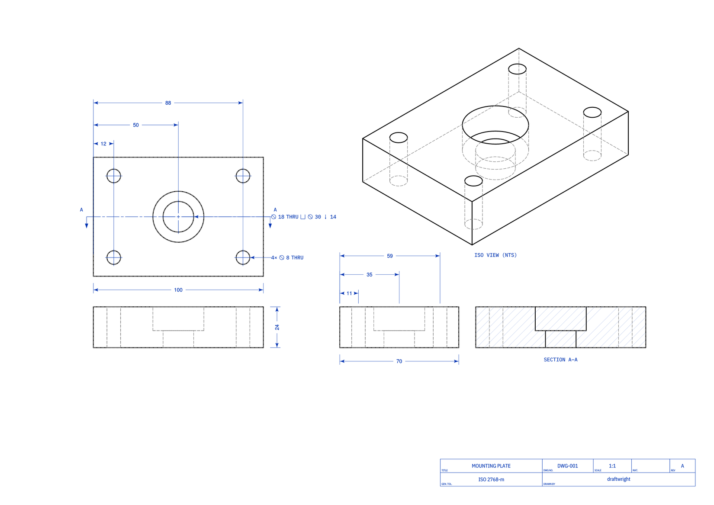

# draftwright

[](https://github.com/pzfreo/draftwright/actions/workflows/ci.yml)
[](https://pypi.org/project/draftwright/)
[](https://pypi.org/project/draftwright/)
[](LICENSE)
[](https://github.com/astral-sh/ruff)

Automated technical-drawing generation for [build123d](https://github.com/gumyr/build123d).
Point it at a solid (or a STEP file) and get a fully-annotated multi-view engineering
drawing — orthographic views, dimensions, section A–A, ISO hatching, title block — ready
to export as PDF, SVG, and DXF.



*A mounting plate, generated automatically: three dimensioned orthographic views, a
counterbored bore callout (`⌀18 THRU ⊔ ⌀30 ↓14`), a `4× ⌀8 THRU` hole-pattern callout,
Section A–A with ISO hatching, an isometric, and an ISO 7200 title block — every
annotation placed by the engine.*

## Quick start

```
pip install draftwright
```

### Command line

Point it at a STEP file — that's the whole workflow:

```
draftwright my_part.step --title "Mounting Plate" --number DWG-001
# writes my_part.pdf (the default)
```

Choose formats, scale, and page; or emit an editable drawing script:

```
draftwright my_part.step --format pdf,dxf     # also: svg, all
draftwright my_part.step --scale 2 --page A3  # override the auto scale / page
draftwright my_part.step --script             # write an editable .py drawing script
```

`draftwright --help` lists every flag; `--version` prints the version.

### Python

One call turns a build123d solid (or a STEP file) into a drawing. This is the exact
part in the image above:

```python
from build123d import Box, Cylinder, Pos
from draftwright import make_drawing

part = (
    Box(100, 70, 24)
    - Pos(0, 0, 0) * Cylinder(9, 40)     # central bore, counterbored below
    - Pos(0, 0, 8) * Cylinder(15, 20)    # counterbore → triggers Section A–A
    - Pos(-38, 24, 0) * Cylinder(4, 40)  # 4× corner holes (recognised as a pattern)
    - Pos(38, 24, 0) * Cylinder(4, 40)
    - Pos(-38, -24, 0) * Cylinder(4, 40)
    - Pos(38, -24, 0) * Cylinder(4, 40)
)
make_drawing(part, out="my_part", title="Mounting Plate", number="DWG-001")
# writes my_part.svg and my_part.dxf   (or from a STEP file: make_drawing(step_file="p.step", out="my_part"))
```

For inspection and editing, get a composable `Drawing`:

```python
from draftwright import build_drawing

dwg = build_drawing(part, title="Mounting Plate")
issues = dwg.lint()                       # list[LintIssue] — coverage, page bounds, ISO
svg_path, dxf_path = dwg.export("my_part")
```

## What it produces

- **Three orthographic views** (front, plan, side) sized and scaled automatically to the
  page
- **Dimensions** on every principal envelope face, plus bore callouts (diameter, depth,
  counterbore, spotface) on all holes, and ø leader-callouts for the external stepped
  diameters of turned parts
- **Section A–A** with ISO 128-44 solid filled cutting-plane arrows and ISO 128-50 45°
  hatching on the cut face, triggered automatically when blind or stepped holes would
  otherwise be hidden-line-only
- **Title block** (ISO 7200) with part name, drawing number, scale, tolerance, and date
- **Lint** — `Drawing.lint()` checks annotation coverage, page bounds, and ISO compliance
  and returns structured `LintIssue` objects

All output is real build123d geometry, so PDF, SVG, and DXF all come from the same
source and dimensions are live on the DXF layer.

Requires Python ≥ 3.10 and build123d ≥ 0.9.0. Annotation primitives are provided by
[`build123d-drafting-helpers`](https://github.com/pzfreo/build123d-drafting-helpers),
installed automatically as a dependency.

## Going further

### Scale and page control

```python
from draftwright import choose_scale

# Auto-select the best ISO/ASME standard scale for an A3 sheet
scale, page_w, page_h, n_steps = choose_scale(80, 60, 20, page="A3")

# Override
make_drawing(part, out="drawing", scale=2.0, page="A2")
```

### Edit, critique, and self-repair

Edit a `Drawing` in **domain vocabulary** — the engine places annotations
automatically, so you say *what* to dimension, not *where*:

```python
dwg = build_drawing(part)

# Inspect detected features and add a dimension in domain terms (auto-placed):
for f in dwg.features("plan"):
    dwg.place_dim(f.page_pos, (f.page_pos[0] + f.diameter, f.page_pos[1]),
                  "below", "plan", dwg.draft, name="dim_pocket")

crit = dwg.lint_summary()   # {"passed", "score", "by_code", "issues":[…suggestion]}
dwg.repair()                # auto-fix mechanically-fixable lint; never worsens
```

Each `LintIssue` carries a domain-meaningful `code` and, when computable, a
ready-to-apply `suggestion`. See `docs/adr/` for the design (deterministic
generation, the lint→repair loop, and the constraint-based layout engine).

## Architecture

draftwright is structured as a **part-drawing compiler** (ADR 0008): feature
detectors → a `PartModel` IR (`Feature`s exposing `DimParameter`s) → a dimensioning
planner → renderers, feeding a shared layout/projection/export stack. It builds on
two libraries:

```
draftwright
    └── build123d-drafting-helpers  — Dimension, Leader, HoleCallout, …
    └── build123d                   — CAD kernel
```

It owns feature recognition (`recognition/`) and linting (`linting/`); annotation
primitives (`Dimension`, `Leader`, etc.) live in `build123d-drafting-helpers` and can
be used independently. The compiler is largely converged in production — turned
dims/lengths, centre marks, envelope, slots, holes (callouts/locations/grouping),
the section A–A trigger, the prismatic step-ladder + rotational furniture, and PMI/GD&T
are all on the IR — the migration is complete (one path; the orchestrator is
build → plan → render). See
[`docs/target-architecture.md`](docs/target-architecture.md) and
[`docs/adr/`](docs/adr/). The engine handles view layout (strip/zone model), scale
selection, annotation placement, and section rendering.
